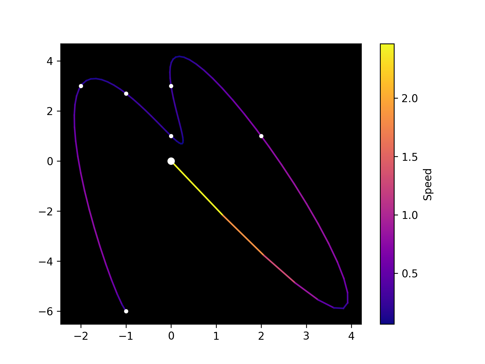

# Parametric Polynomial Interpolation

## Especificação

> Na tela gráfica, 
o usuário com o mouse escolhe n pontos quaisquer, 
cada ponto deve estar associado a um valor de parâmetro ti, também dado pelo usuário, 
e o seu sistema deverá interpolar (apresentar uma curva polinomial paramétrica que passa pelos pontos).

> A forma de resolução é através da montagem de um sistema para cada dimensão x e y, na forma monomial, 
por QR (ver livro de G. Farin: Curve and Surface for CAGD, quarta edição, cap. 6). 

> Extras
> 1. parametric 3D curve
>     - adds z(t)
> 2. grid curves
>     - side by side curves
>     - "surface lines"
> 3. simple surface
>     - curves product
>     - interpolation between grid curves
> 4. surface
>     - bilinear surfaces
> - sistemas lineares resolvidos por ambos os
métodos iterativos estudados em aula. 

## Referências

- [G. Farin: Curve and Surface for CAGD, fourth edition, cap. 6](http://lib.ysu.am/open_books/416463.pdf)
