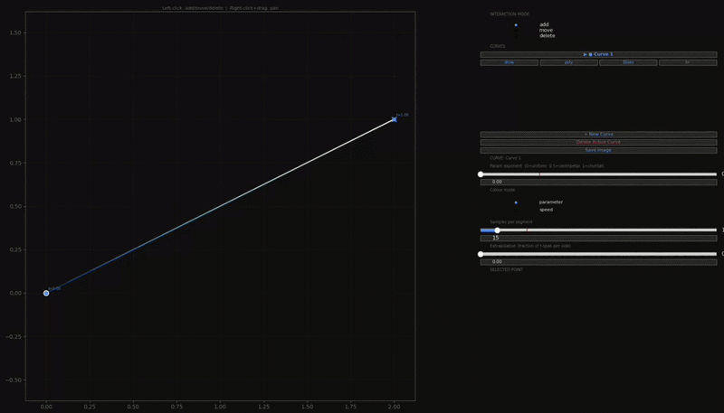
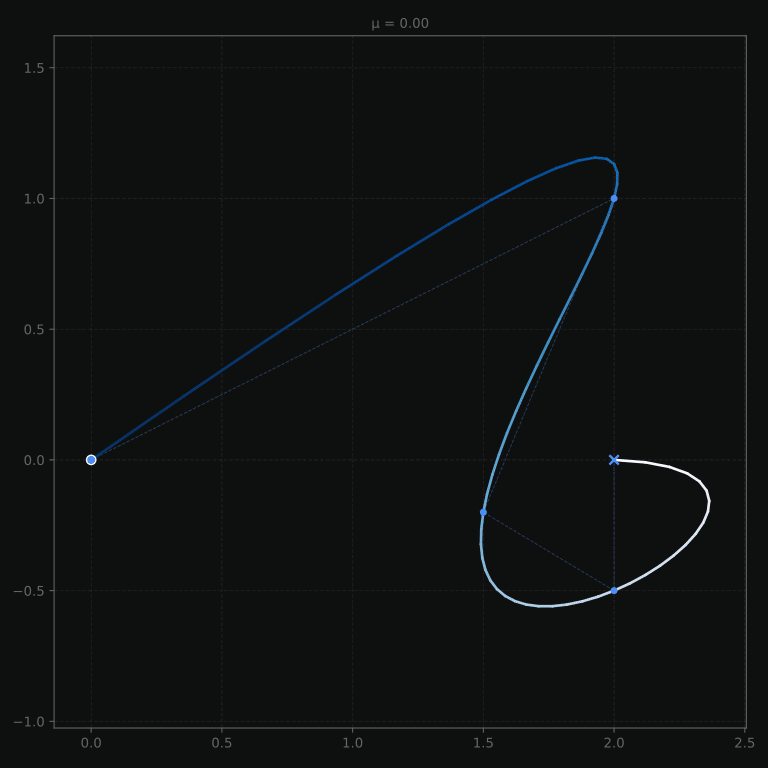

# Parametric Polynomial Interpolation

An interactive tool for **constructing** and **visualising** 
2-D parametric polynomial curves.


---

## Table of Contents

1. [Installation](#installation)
2. [Quick Start](#quick-start)
3. [Usage](#usage)
4. [Features](#features)
5. [Parametrization Method (μ values)](#parametrization-method-μ-values)
6. [Architecture](#architecture)
7. [Project Structure](#project-structure)
8. [Known Limitations](#known-limitations)
9. [Future Ideas](#future-ideas)
10. [References](#references)

---

## Installation

**Requirements:** Python 3.10+, a Qt backend for Matplotlib.

```bash
pip install -r requirements.txt
```

Clone and run:

```bash
git clone https://github.com/renatocorreia-rmcm/parametric-polynomial-interpolation.git
cd parametric-polynomial-interpolation
python visualizer.py
```

---

## Quick Start

```python
from visualizer import InteractiveVisualizer
import numpy as np

vis = InteractiveVisualizer()

pts = np.array([[0, 0], [1, 2], [3, 1], [4, 3]], dtype=float)  # Optionally pre-load points as (N, 2) array [x, y]  # or (N, 3) array [t, x, y] if you want manual parameter values
vis.load_points(pts)

vis.show()
```

Or simply run `python visualizer.py`.

---

## Usage

Select $n$ arbitrary points $(x, y)$ on the canvas with your mouse. 
The program assigns a parameter value $t$ to each point automatically (according to the chosen $μ$)
and fits a polynomial curve $\ r(t) = (X(t), Y(t))$ through all of them.


### Features

- **Multiple curves** — create and manage several independent curves simultaneously.

- **Point editing** — add, move, and delete control points interactively. Edit $x$, $y$, and $t$ via sliders or typed text boxes.

- **Automatic parametrization** — choose the interpolation blending factor $\mu$. Then $t$ values are recomputed on the fly.

- **Manual $t$ override** — drag the $t$ slider (or type) for any selected point to assign an exact parameter value.

- **Colour modes** — colour the curve by parameter value $t$ or by speed $\| \frac{dr}{dt} \|$.

- **Adjustable sample density** — slide to increase or decrease the number of plotted curve points per segment. This affects the curve resolution.

- **Extrapolation** — extend the polynomial beyond the first and last control points.

- **Export** — save a clean SVG of all visible curves to `output/curves_NNN.svg`.

---

## Parametrization Method ($\mu$ values)

The parameter $t$ is not a spacial coordinate — it is an abstract value assigned to each point that controls how the polynomial is paced. 

Although the resulting curve is clearly not a polynomial, each axis of it is indeed a polynomial:
$$r(t) = (X(t), Y(t))$$


The formula for assigning $t$ automatically given a set of points $(x, y)_i$ is:

$$t_0 = 0$$

$$t_{i+1} = t_i + d_i$$

$$d_i = \|P_{i+1} - P_i\|^{\mu}$$

The exponent $\mu$ controls the relationship between chord length and parameter spacing:


|Uniform|Centripetal|Chordal|
|---|---|---|
|$\mu = 0$|$\mu = 0.5$|$\mu = 1$|
|Every segment gets the same $\Delta t$ regardless of how long it is in space. Fast to compute and predictable, but can cause the curve to bunch or loop near clusters of closely-spaced points.|$\Delta t$ grows as the square root of the chord length. Strikes a good balance: it avoids looping artefacts that uniform parametrization can produce, without over-stretching like chordal. Generally the most robust choice for arbitrary input.|$\Delta t$ equals the chord length. The parameter is proportional to arc length, so the curve is paced like physical distance. Can produce unwanted oscillations (Runge-like) when control points are unevenly spaced.|




---

## Architecture

The program is split into four modules with a clean data flow:

```
User clicks (visualizer.py)
    │
    ▼
Parametize (parametize.py)
    Assigns t values to each (x, y) point using the chosen $\mu$.
    Produces an (N, 3) array [t, x, y].
    │
    ▼
Vandermonde (vandermond.py)
    Builds the Vandermonde matrix T where T[i,j] = t_i^j.
    Sets up two linear systems: T·cx = x  and  T·cy = y.
    │
    ▼
Householder QR (householder.py)
    Decomposes T = QR (orthogonal × upper-triangular).
    Solves both systems in one pass via back-substitution.
    Coefficients cx, cy are cached until control points change.
    │
    ▼
Sampling (sampling.py)
    Evaluates px(t) and py(t) at a dense linspace of t values.
    Returns an (M, 3) array [t, px(t), py(t)] for plotting.
    │
    ▼
Render (visualizer.py)
    Draws the curve as a LineCollection coloured by t or speed.
```

### Why Householder QR?

Solving the Vandermonde system by Gaussian elimination is notoriously ill-conditioned for high-degree polynomials. Householder reflections orthogonalise the system without building the reflection matrices explicitly, using the identity `H·A = A − 2u(uᵀA)`, which is both more numerically stable and avoids O(n²) storage for each reflector. The QR factorisation is computed once and reused for both the `x` and `y` right-hand sides.

---

## Project Structure

```
.
├── visualizer.py      # Interactive Matplotlib UI; entry point
├── vandermond.py      # Vandermonde matrix construction and system setup
├── householder.py     # QR decomposition and solver
├── parametize.py      # Automatic t-value assignment (μ parametrization)
├── sampling.py        # Dense polynomial evaluation for plotting
├── assets/            # Static images used in this README
└── output/            # Exported SVG files (created on first save)
```

---

## Known Limitations

- **Runge's phenomenon** — high-degree global polynomial interpolation (many points) can oscillate wildly near the boundary, especially with chordal parametrization or non-uniform point spacing. This is inherent to the method, not a bug.
- **Duplicate `t` values** — if two control points are assigned the same parameter value, the Vandermonde matrix becomes singular and sampling is skipped. The UI silently drops the curve in this case.
- **No spline fallback** — a single global polynomial is fit to all points. For large point sets (> ~15), consider switching to piecewise cubic splines instead.
- **Qt backend required** — Matplotlib's interactive features need a Qt window; headless environments are not supported.

---

## Future Ideas

- **3-D parametric curve** — add a `z(t)` dimension.
- **Grid curves / surface lines** — side-by-side curves forming a mesh.
- **Simple surface** — product of two curve families; bilinear interpolation between grid curves.
- **Piecewise interpolation** — local cubic patches to avoid Runge's phenomenon for large point sets.

---

## References

- [*Curves and Surfaces for CAGD* (4th ed., Ch. 6) — Gerald Farin](http://lib.ysu.am/open_books/416463.pdf)
- [*Parameterization for Curve Interpolation* (2005) — Floater & Surazhsky](https://www.mn.uio.no/math/english/people/aca/michaelf/papers/curve_survey.pdf)
