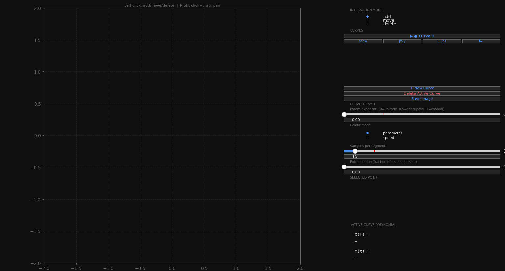
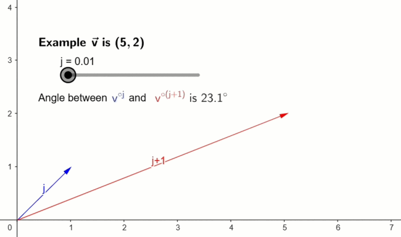

# Parametric Polynomial Interpolation

An interactive tool for **constructing** and **visualising** 
2-D parametric polynomial curves.


## Table of Contents

- [Installation](#installation)
- [Quick Start](#quick-start)
- [Features](#features)
- [Parameter $t$ and Auto Parametrization in function of $\mu$](#parameter-t-and-auto-parametrization-in-function-of-mu)
- [Program Flow](#program-flow)
- [The ill-conditioning of Vandermonde matrices](#the-ill-conditioning-of-vandermonde-matrices)
- [Why Householder QR Decomposition?](#why-householder-qr-decomposition)
- [Project Structure](#project-structure)
- [Known Limitations](#known-limitations)
- [Future Ideas: expand to 3-D](#future-ideas-expand-to-3-d)
- [References](#references)


## Installation

```bash
git clone https://github.com/renatocorreia-rmcm/parametric-polynomial-interpolation.git
cd parametric-polynomial-interpolation
pip install -r requirements.txt  # Matplotlib, numpy, scipy
```


## Quick Start
```bash
python graphical_interface.py
```
or
```python
from graphical_interface import InteractiveVisualizer
vis = InteractiveVisualizer()
vis.show()
```

You should then see a **blank canvas at left**, and a **control panel at right**. Click on the canvas to add points as the curve interpolates in real time. Adjust fine parameters at the pannel, according to each section label.




## Features

- **Multiple curves** — create and manage independent curves simultaneously.

- **Point editing** — add, move, and delete points interactively. Edit $x$, $y$, and $t$ via sliders or typed text boxes.

- **Automatic parametrization** — choose the interpolation blending factor $\mu$.

- **Manual $t$ override** — set an arbitrary $t$ value for any selected point.

- **Colour modes** — colour the curve by parameter value ($t$) or by speed ($\Delta t$).

- **Adjustable sample density** — Set the number of plotted curve points. This affects the curve resolution (edges smoothness).

- **Extrapolation** — extend the polynomial beyond its endpoints.

- **Export** — save a clean SVG of all visible curves to `output/curves_NNN.svg`.


## Parameter $t$ and Auto Parametrization in function of $\mu$

The parameter $t$ is an abstract value assigned to each point that controls how the polynomial is paced. 

Although the resulting curve is clearly not a polynomial, each coordinate axis of it can be expressed as a polynomial function of $t$:

$$r(t) = (X(t), Y(t))$$

The formula for assigning $t$ automatically given a set of points $p_i = (x_i, y_i)$ is:

$$t_0 = 0$$

$$t_{i+1} = t_i + d_i$$

$$d_i = \|P_{i+1} - P_i\|^{\mu}$$

The exponent $\mu$ controls the relationship between chord length and parameter spacing. 

These are some notable values.

|Uniform|Centripetal|Chordal|
|---|---|---|
|$\mu = 0$|$\mu = 0.5$|$\mu = 1$|
|$\Delta t$ = 1. So $t_i = i$ for all $p_i$|$\Delta t$ grows as the square root of the chord length.|$\Delta t$ equals the chord length.|
|Intuitive and predictable. Can cause the curve to bunch or loop near clusters of closely-spaced points.| Strikes a good balance: it avoids looping artefacts that uniform parametrization can produce, without over-stretching like chordal.|Proportional to arc length, so the curve is paced like physical distance. Can produce unwanted oscillations (Runge-like) when points are unevenly spaced.|


*Same control points in different parametrizations*


## Program Flow

1. Graphical Interface
    * Read user given points.

2. Linear System Setup
    * Builds the Vandermonde matrix $T$ of parameters:
        $$T_{i, j} = [t_i^j]$$
        
    * Builds 2 linear systems

        $$T·\vec{c_x} = \vec{x}$$

        $$T·\vec{c_y} = \vec{y}$$

        Wich can be done in one go by

        $$T·[\vec{c_x} \ \vec{c_y}] = [\vec{x} \ \vec{y}]$$
        
        Where $\vec{c_x}$ and $\vec{c_y}$ are the polynomial coefficients 
        for $X(t)$ and $Y(t)$ respectively.

3. Linear System Solving
    * Decomposes $T = Q \cdot R$ (orthogonal × upper-triangular) using **Householder Reflections**.
        * Bisector vector between $\vec{a_i}$ and $\vec{e_i}$
            $$\vec{v_i} := \vec{a_i} + \text{sign}(\langle \vec{a_i}, \vec{e_i} \rangle) \cdot \|\vec{a_i}\| \cdot \vec{e_i} $$
            $$\vec{u_i} := \frac{\vec{v_i}}{\|\vec{v_i}\|} \text{ is the bisector vector}$$

        * Implicit reflections

            $$Q H_i := Q - 2 \cdot (Q \cdot \vec{u_i}) \cdot \vec{u_i}^T$$
            
            $$H_i R := R - 2 \cdot \vec{u_i} \cdot (\vec{u_i}^T \cdot R)$$

    * Solves both systems via back-substitution.
        
        $$R \cdot \vec{c_x} = Q^T \cdot \vec{x}$$

        $$R \cdot \vec{c_y} = Q^T \cdot \vec{y}$$

        Wich can be done in one go by

        $$R \cdot [\vec{c_x} \ \vec{c_y}] = Q^T \cdot [\vec{x} \ \vec{y}]$$
        


4. Sampling

    Evaluates $X(t), Y(t)$ at a denser linspace of $t$ values, beyond the control points, given by user `sampling_rate` and `extrapolation_factor`.

    Returns an `(M, 3)` array of points $[(t, X(t), Y(t))]$ **ready for plotting**.

5. Graphical Interface

    Draws the curve as a LineCollection of segments $s_i = ((t_{i}, X(t_i), Y(t_i)),\ (t_{i+1}, X(t_{i+1}), Y(t_{i+1})))$ coloured by parameter value ($t_i$) or speed ($\Delta t_i$).

## The ill-conditioning of Vandermonde matrices

The Vandermonde matrix is built from columns $[t_i^0,\ t_i^1,\ t_i^2,\ \ldots,\ t_i^n]$. 

As the degree grows, higher-power columns like $t^8$ and $t^9$ become nearly the same direction.


*Interactive graph: [geogebra.org/calculator/wun6hjsc](https://www.geogebra.org/calculator/wun6hjsc)* <br>
    
Notice how directions of columns $t_{i}^5$ and $t_{i}^6$ are almost the same. So will be to all further columns.
$$\frac{v^{\circ 5}}{\|v^{\circ 5}\|} 
\approx \frac{v^{\circ 6}}{\|v^{\circ 6}\|}
\approx \frac{v^{\circ (...)}}{\|v^{\circ (...)}\|}$$

As columns become nearly linearly dependent, matrix gets nearly singularity.

A possible geometric interpretation is that, the higher the degree, the more "room" the polynomial has to oscillate between the points — and the solver has to find one exact solution among many near-solutions, which is inherently sensitive to perturbations.


## Why Householder QR Decomposition?

The choice is primarily one of **numerical stability**:

As seen, Vandermonde matrices are notoriously ill-conditioned — their condition number grows exponentially with degree.

**Non orthogonal methods**, such as **Gaussian Elimination** and **LU decomposition** amplify small floating-point errors, leading to wildly inaccurate results for even moderately sized problems. Small floating-point errors in the **forward pass pivoting** get catastrophically amplified during **back-substitution**.

**Orthogonal transformations** are preferred because they preserve the vectors norms, so they don't amplify errors.

Although **Gram-Schmidt QR** is orthogonal, it also accumulate errors because it does the **projections** column by column, as $Q$ gradually loosens orthogonality.

But **Householder QR** uses **reflections**, so rounding errors do not compound across steps. It has the same asymptotic cost, but far better numerical behaviour.


## Project Structure

```
.
├── graphical_interface.py  # Interactive MPL UI; entry point
├── parameterize.py      # Automatic t-value assignment
├── vandermonde.py      # Vandermonde matrix construction
├── householder.py     # QR decomposition and solver
├── sampling.py        # Dense polynomial evaluation for plotting
├── output/            # Exported SVG files (after first save)
└── assets/            # Static images used in this README
```

## Known Limitations

- **Runge's phenomenon** — high-degree global polynomial interpolation (many points) can oscillate wildly near the boundary, especially with chordal parametrization or non-uniform point spacing. This is inherent to the method, not a bug.
- **Duplicate `t` values** — if two control points are assigned the same parameter value, the Vandermonde matrix becomes singular and sampling is skipped.
- **No spline fallback** — a single global polynomial is fit to all points. For large point sets (> ~15), consider switching to piecewise cubic splines instead.

## Future Ideas: expand to 3-D

This architecture generalises naturally to higher dimensions.
1. **3-D parametric curve** — add a $z(t)$ dimension.
2. **Grid curves / surface lines** — side-by-side curves forming a mesh.
3. **Simple surface** — product of two curve families; bilinear interpolation between grid curves.


## References

- [*Curves and Surfaces for CAGD* (4th ed., Ch. 6) — Gerald Farin](http://lib.ysu.am/open_books/416463.pdf)
- [*Parameterization for Curve Interpolation* (2005) — Floater & Surazhsky](https://www.mn.uio.no/math/english/people/aca/michaelf/papers/curve_survey.pdf)
