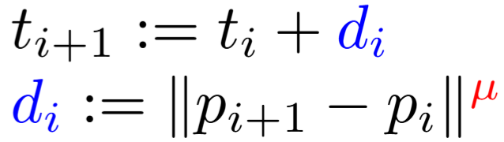

# Parametric Polynomial Interpolation

## Specification

### Use
Selects, using the mouse, `n` arbitrary points `(t, x, y)`,
each with an arbitrary **parameter value** `t` and `(x, y)` **space coordinates**.

Then the system  interpolates a parametric polynomial curve between the points

### Features

**Add, move and delete points** in a curve.
New points can be added even in between existing points, 
just select the curve mid-point before inserting a new one in between.

**Create and manage multiple curves** at the same time.

**Set interpolation blending parameter `μ`** for each curve. ([Detailed here](#parametrization-method-μ-values))

**Set colour mode according to variation rates** (position, speed, acceleration, ...)

**Set curve resolution** (Amount of samples between each point)

### Operation
The resolution is done by setting up a system for each dimension x and y, in monomial form,
and solve using **QR decomposition** by **HouseHolder reflections**.

## Parametrization method (`μ` values)

### Arbitrary

### Uniform  `μ = 0`

### Centripetal `μ = 0.5`

### Chordal `μ = 1`

> extra TODOs
> 
> Expand Dimensions:
>   1. parametric 3D curve
>      - adds z(t)
>   2. grid curves
>       - side by side curves
>       - "surface lines"
>   3. simple surface
>       - curves product
>       - interpolation between grid curves
>   4. surface
>       - bilinear surfaces

## References

- [*Curves and Surfaces for CAGD* (4th ed., Ch. 6) — Gerald Farin](http://lib.ysu.am/open_books/416463.pdf)
- [*Parameterization for Curve Interpolation* (2005) — Michael S. Floater, Tatiana Surazhsky](https://www.mn.uio.no/math/english/people/aca/michaelf/papers/curve_survey.pdf)
