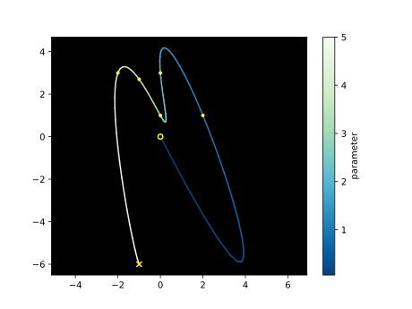
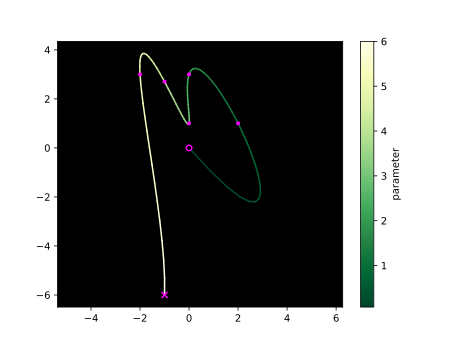
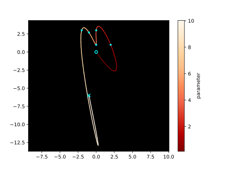
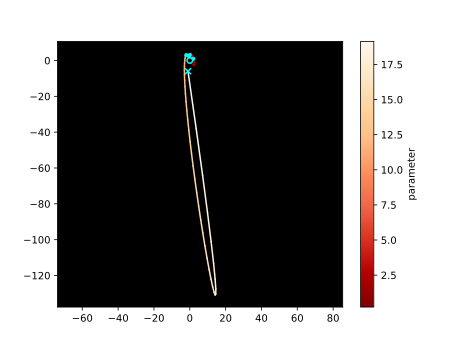

# Parametric Polynomial Interpolation

### Manual

### Uniform - 0

### Centripetal - 0.5

### Chordal - 1

## Especificação

> Na tela gráfica, 
o usuário com o mouse escolhe n pontos quaisquer, 
cada ponto deve estar associado a um valor de parâmetro ti, também dado pelo usuário, 
e o seu sistema deverá interpolar (apresentar uma curva polinomial paramétrica que passa pelos pontos).

> A forma de resolução é através da montagem de um sistema para cada dimensão x e y, na forma monomial, 
por QR (ver livro de G. Farin: Curve and Surface for CAGD, quarta edição, cap. 6). 

> Extras
> - expand dimensions
>   1. parametric 3D curve
>      - adds z(t)
>   2. grid curves
>       - side by side curves
>       - "surface lines"
>   3. simple surface
>       - curves product
>       - interpolation between grid curves
>   4. surface
>       - bilinear surfaces

## References

- [*Curves and Surfaces for CAGD* (4th ed., Ch. 6) — Gerald Farin](http://lib.ysu.am/open_books/416463.pdf)
- [*Parameterization for Curve Interpolation* (2005) — Michael S. Floater, Tatiana Surazhsky](https://www.mn.uio.no/math/english/people/aca/michaelf/papers/curve_survey.pdf)
